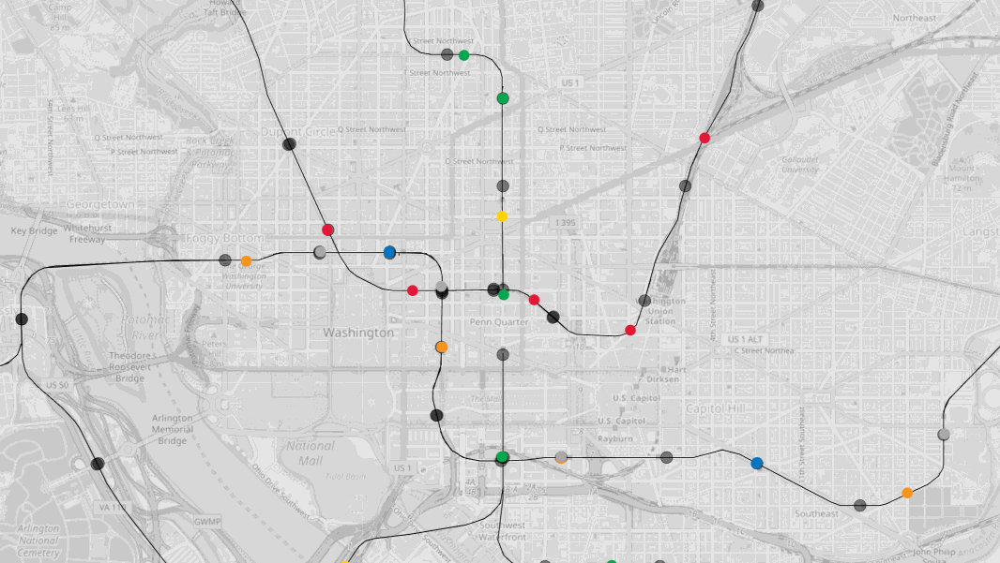
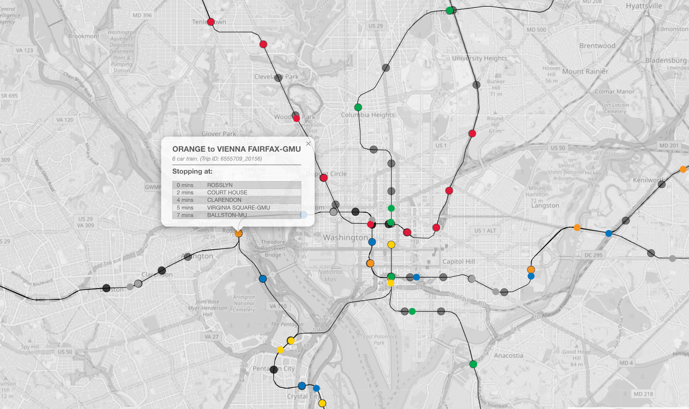

# CrateDB GTFS / GTFS-RT Transit Data Demo

## Introduction

This is a demo application that has a Python back end and JavaScript / Leaflet maps front end.  It uses GTFS ([General Transit Feed Specification](https://gtfs.org/)) and GTFS-RT (the extra [realtime feeds for GTFS](https://gtfs.org/documentation/realtime/reference/)) to store and analyze transit system route, trip, stop and vehicle movement data in [CrateDB](https://cratedb.com).

GTFS and GRTFS-RT are standard ways of representing this type of data.  This means that, in theory, this project could be applicable to any transit system that adopts this approach.  However, there can be differences between transit agencies, so some aspects of the project may need adapting for that.  

We have developed this demo using GTFS and GTFS-RT data from the [Washington Metropolitan Area Transit Authority](https://www.wmata.com/about/developers/) (WMATA), specifically for the DC Metro train system.  The design of the database schema allows for data from multiple agencies / transit systems to be stored as long as each agency has a unique agency ID.

Here's a sped up demo of the front end running, showing train movements on the DC Metro system:



Individual trains can be tracked by clicking on them, which displays information about the train's current trip in a popup:



## Prerequisites

To run this project you'll need to install the following software:

* Python 3 ([download](https://www.python.org/downloads/)) - we've tested this project with Python 3.12.2 on macOS Sequoia.
* Git command line tools ([download](https://git-scm.com/downloads)).
* Your favorite code editor, to edit configuration files and browse/edit the code if you wish.  Visual Studio Code is great for this.
* Access to a cloud or local CrateDB cluster (see below for details).
* A WMATA API key.  These are free, and you can register for API access and get your key at the [WMATA developer portal](https://developer.wmata.com/).

## Getting the Code

Next you'll need to get a copy of the code from GitHub by cloning the repository. Open up your terminal and change directory to wherever you store coding projects, then enter the following commands:

```bash
git clone https://github.com/crate/devrel-gtfs-transit.git
cd devrel-gtfs-transit
```

## Getting a CrateDB Database

You'll need a CrateDB database to store the project's data in.  Choose between a free hosted instance in the cloud, or run the database locally.  Either option is fine.

### Cloud Option

Create a database in the cloud by first pointing your browser at [`console.cratedb.cloud`](https://console.cratedb.cloud/).

Login or create an account, then follow the prompts to create a "CRFREE" database on shared infrastructure in the cloud of your choice (choose from Amazon AWS, Microsoft Azure and Google Cloud).  Pick a region close to where you live to minimize latency between your machine running the code and the database that stores the data. 

Once you've created your cluster, you'll see a "Download" button.  This downloads a text file containing a copy of your database hostname, port, username and password.  Make sure to download these as you'll need them later and won't see them again.  Your credentials will look something like this example (exact values will vary based on your choice of AWS/Google Cloud/Azure etc):

```
Host:              some-host-name.gke1.us-central1.gcp.cratedb.net
Port (PostgreSQL): 5432
Port (HTTPS):      4200
Database:          crate
Username:          admin
Password:          the-password-will-be-here
```

Wait until the cluster status shows a green status icon and "Healthy" status before continuing.  Note that it may take a few moments to provision your database.

### Local Option

The best way to run CrateDB locally is by using Docker.  We've provided a Docker Compose file for you.  Once you've installed [Docker Desktop](https://www.docker.com/products/docker-desktop/), you can start the database like this:

```bash
docker compose up
```

Once the database is up and running, you can access the console by pointing your browser at:

```
http://localhost:4200
```

Note that if you have something else running on port 4200 (CrateDB admin UI) or port 5432 (Postgres protocol port) you'll need to stop those other services first, or edit the Docker compose file to expose these ports at different numbers on your local machine.

## Creating the Database Tables

We've provided a Python data loader script that will create the database tables in CrateDB for you.

You'll first need to create a virtual environment for the data loader and configure it:

```bash
cd gtfs-static
python -m venv venv
. ./venv/bin/activate
pip install -r requirements.txt
```

Now make a copy of the example environment file provided:

```bash
cp env.example .env
```

Edit the `.env` file, changing the value of `CRATEDB_URL` to be the connection URL for your CrateDB database.

If you're running CrateDB locally (for example with the provided Docker Compose file) there's nothing to change here.

If you're running CrateDB in the cloud, change the connection URL as follows, using the values for your cloud cluster instance:

```
https://admin:<password>@<hostname>:4200
```

Save your changes.

Next, run the data loader to create the tables used by this project:

```bash
python dataloader.py createtables
```

You should see output similar to this:

```
Created agencies table if needed.
Created networks table if needed.
Created routes table if needed.
Created vehicle positions table if needed.
Created trip updates table if needed.
Created trips table if needed.
Created stops table if needed.
Created stop_times table if needed.
Created config table if needed.
Finished creating any necessary tables.
```

Use the CrateDB console to verify that the above named tables were all created in the `doc` schema.

## Load the Static Data

The next step is to load static data about the transport network into the database.  We'll use Washington DC (WMATA) as an example. 

First, load the configuration data for the agency:

```bash
python dataloader.py config-files/wmata.json
```

Now, load data into the `agencies` table:

```bash
python dataloader.py data-files/wmata/agency.txt
```

Next, populate the `routes` table:

```bash
python dataloader.py data-files/wmata/routes.txt
```

Then the stops table.  Here, `1` is the agency ID, and must match the spelling and capitalization of the agency ID in `agency.txt`:

```bash
python dataloader.py data/files/wmata/stops.txt 1
```

Finally, insert data into the `networks` table.  Here `WMATA` is the agency name, and must match the spelling and capitalization of the agency name in `agency.txt`:

```bash
python dataloader.py geojson/wmata/wmata.geojson WMATA
```

## Start the Front End Flask Application

This project has a web front end and a [Flask](https://flask.palletsprojects.com/) application server.  The front end is written in vanilla JavaScript and uses the [Bulma](https://bulma.io/) framework for the majority of the styling. [Leaflet](https://leafletjs.com/) is used to render maps and handle map events.  The Flask application uses the [CrateDB Python driver](https://cratedb.com/docs/python/en/latest/index.html) to talk to the database.

Before starting the front end Flask application, you'll need to create a virtual environment and configure it:

```bash
cd front-end
python -m venv venv
. ./venv/bin/activate
pip install -r requirements.txt
```

Now make a copy of the example environment file provided:

```bash
cp env.example .env
```

Edit the `.env` file, changing the value of `CRATEDB_URL` to be the connection URL for your CrateDB database.

If you're running CrateDB locally (for example with the provided Docker Compose file) there's nothing to change here.

If you're running CrateDB in the cloud, change the connection URL as follows, using the values for your cloud cluster instance:

```
https://admin:<password>@<hostname>:4200
```

Now, edit the values of `GTFS_AGENCY_NAME` and `GTFS_AGENCY_ID` to contain the agency name and ID for the agency you're using.  These should match the values returned by this query:

```sql
SELECT agency_name, agency_id FROM agencies
```

For example, for Washington DC / WMATA, the correct settings are:

```
GTFS_AGENCY_NAME=WMATA
GTFS_AGENCY_ID=1
```

Don't forget that if either value contains a space, you'll need to surround the entire value with quotation marks.

Save your changes.

Now, start the front end application:

```bash
python app.py
```

Using your browser, visit `http://localhost:8000` to view the map front end interface.  

At this point you should see the route map for the agency that you're working with, along with the stations / stops on the routes.  Clicking a station or stop should show information about it.

No vehicles will be visible on the map yet.  To see these, you'll need to run the real time data receiver components (see below).  

When you're finished with the real time data receiver, stop it with `Ctrl-C` (but keep it running for now, so you'll be able to see the real time data soon...)

## Start the Real Time Data Receiver Components

The real time data receivers are responsible for reading real time vehicle location and other data from the transit agencies and saving it in the database.

First, create a virtual environment and install the dependencies:

```bash
cd front-end
python -m venv venv
. ./venv/bin/activate
pip install -r requirements.txt
```

Now make a copy of the example environment file provided:

```bash
cp env.example .env
```

Edit the `.env` file, changing the value of `CRATEDB_URL` to be the connection URL for your CrateDB database.

If you're running CrateDB locally (for example with the provided Docker Compose file) there's nothing to change here.

If you're running CrateDB in the cloud, change the connection URL as follows, using the values for your cloud cluster instance:

```
https://admin:<password>@<hostname>:4200
```

Now, edit the value of `GTFS_AGENCY_ID` to contain the ID for the agency you're using.  It should match the value returned by this query:

```sql
SELECT agency_id FROM agencies
```

For example, for Washington DC / WMATA, the correct setting is:

```
GTFS_AGENCY_ID=1
```

Set the value of `SLEEP_INTERVAL` to be the number of seconds that the component sleeps between checking the transit agency for updates.  This defaults to `1`, but you may need to set a longer interval if the agency you're using implements rate limiting on its API endpoints.

Next, set the value of `GTFS_POSITIONS_FEED_URL` to the realtime vehicle movements endpoint URL for your agency.  For example for Washington DC / WMATA this is `https://api.wmata.com/gtfs/rail-gtfsrt-vehiclepositions.pb`.

Set the value of `GTFS_TRIPS_FEED_URL` to the realtime trip updates endpoint URL for your agency. For example for Washington DC / WMATA this is `https://api.wmata.com/gtfs/rail-gtfsrt-tripupdates.pb`.

Set the value of `GTFS_TRIPS_SCHEDULE_URL` to the static GTFS URL for your agency.  This will be a URL that serves a zip file.  For example for Washington DC / WMATA this is `https://api.wmata.com/gtfs/rail-gtfs-static.zip`.

Finally, if your agency requires an API key to access realtime data, set the values of `GTFS_POSITIONS_FEED_KEY`, `GTFS_TRIPS_FEED_KEY` and `GTFS_TRIPS_SCHEDULE_KEY` appropriately.  You'll most likely use the same API key for each.

Save your changes.

The schedule of trips is stored in two tables in CrateDB: `trips` and `stop_times`.  You need to update this **once daily** by running:

```bash
python trip_schedule.py 1
```

Start gathering real time vehicle position data continuously by running this command:

```bash
python vehicle_positions.py
```

You should also start continuous gathering of real time trip update data by running:

```bash
python trip_updates.py
```

When you're finished with the real time data receivers, stop them with `Ctrl-C`.

Assuming that the Flask front end web application is running, you should now see vehicle movement details at `http://localhost:8000`.  Clicking a vehicle should display a pop up with information about the trip that the vehicle is currently on: trip ID, next stops, time estimates etc.

## Analyzing the Data

Once the system's been running for a while, you might want to run some queries that analyze and aggregate data.  We've provided some examples in the [`example_queries.md`](example_queries.md) file.

## Work in Progress Notes Below

Getting GeoJSON from GTFS:

https://github.com/BlinkTagInc/gtfs-to-geojson

```bash
cd gtfs-static
gtfs-to-geojson --configPath ./config_wmata.json
```

Getting GTFS static data for WMATA rail:

```bash
wget --header="api_key: <REDACTED>" https://api.wmata.com/gtfs/rail-gtfs-static.zip
```